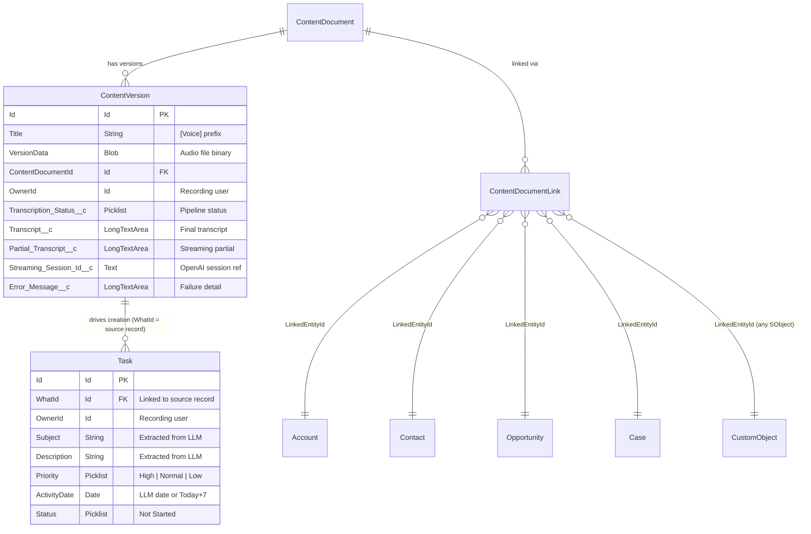

# Data Model: Salesforce Voice Intelligence Layer

**Feature**: `003-salesforce-voice-intelligence-layer`
**Date**: 2026-04-14
**API Version**: 65.0

---

## Entity Relationship Diagram



---

## ContentVersion — Custom Field Definitions

### Field 1: `Transcription_Status__c`

| Property | Value |
|---------|-------|
| **API Name** | `Transcription_Status__c` |
| **Label** | Transcription Status |
| **Type** | Picklist |
| **Required** | No (set by Apex immediately on insert) |
| **Default** | `Recording` |
| **Restricted** | Yes (only values below are valid) |

**Picklist Values**:
| Value | API Label | Description |
|-------|-----------|-------------|
| `Recording` | Recording | Audio is actively being captured |
| `Streaming` | Streaming | Chunks being sent for partial transcription |
| `Finalizing` | Finalizing | Recording stopped; awaiting full Whisper transcription |
| `Extracting Tasks` | Extracting Tasks | Whisper done; GPT task extraction in progress |
| `Completed` | Completed | Full pipeline succeeded |
| `Failed` | Failed | Unrecoverable error; see `Error_Message__c` |
| `Queued — Pending Capacity` | Queued — Pending Capacity | Queueable flex queue was full at time of enqueue |

**Metadata XML**:
```xml
<?xml version="1.0" encoding="UTF-8"?>
<CustomField xmlns="http://soap.sforce.com/2006/04/metadata">
    <fullName>Transcription_Status__c</fullName>
    <label>Transcription Status</label>
    <type>Picklist</type>
    <valueSet>
        <restricted>true</restricted>
        <valueSetDefinition>
            <sorted>false</sorted>
            <value><fullName>Recording</fullName><default>true</default><label>Recording</label></value>
            <value><fullName>Streaming</fullName><default>false</default><label>Streaming</label></value>
            <value><fullName>Finalizing</fullName><default>false</default><label>Finalizing</label></value>
            <value><fullName>Extracting Tasks</fullName><default>false</default><label>Extracting Tasks</label></value>
            <value><fullName>Completed</fullName><default>false</default><label>Completed</label></value>
            <value><fullName>Failed</fullName><default>false</default><label>Failed</label></value>
            <value><fullName>Queued — Pending Capacity</fullName><default>false</default><label>Queued — Pending Capacity</label></value>
        </valueSetDefinition>
    </valueSet>
</CustomField>
```

---

### Field 2: `Transcript__c`

| Property | Value |
|---------|-------|
| **API Name** | `Transcript__c` |
| **Label** | Transcript |
| **Type** | Long Text Area |
| **Length** | 131,072 characters (128KB) |
| **Required** | No |
| **Visible Lines** | 10 |
| **Set By** | `VoiceTranscriptionService` after Whisper completes |

**Metadata XML**:
```xml
<?xml version="1.0" encoding="UTF-8"?>
<CustomField xmlns="http://soap.sforce.com/2006/04/metadata">
    <fullName>Transcript__c</fullName>
    <label>Transcript</label>
    <type>LongTextArea</type>
    <length>131072</length>
    <visibleLines>10</visibleLines>
</CustomField>
```

---

### Field 3: `Partial_Transcript__c`

| Property | Value |
|---------|-------|
| **API Name** | `Partial_Transcript__c` |
| **Label** | Partial Transcript |
| **Type** | Long Text Area |
| **Length** | 32,768 characters (32KB) |
| **Required** | No |
| **Visible Lines** | 5 |
| **Set By** | `StreamingTranscriptionController` per chunk (optional write-back) |

> **Note**: Partial transcript is primarily held in LWC state (`partialTranscript` JS property). Writing to `Partial_Transcript__c` is optional and can be enabled for audit/debug purposes without impacting the primary UX flow.

**Metadata XML**:
```xml
<?xml version="1.0" encoding="UTF-8"?>
<CustomField xmlns="http://soap.sforce.com/2006/04/metadata">
    <fullName>Partial_Transcript__c</fullName>
    <label>Partial Transcript</label>
    <type>LongTextArea</type>
    <length>32768</length>
    <visibleLines>5</visibleLines>
</CustomField>
```

---

### Field 4: `Streaming_Session_Id__c`

| Property | Value |
|---------|-------|
| **API Name** | `Streaming_Session_Id__c` |
| **Label** | Streaming Session ID |
| **Type** | Text |
| **Length** | 255 |
| **Required** | No |
| **Unique** | No |
| **Set By** | `AudioRecorderController` on ContentVersion insert (UUID generated in LWC) |

**Metadata XML**:
```xml
<?xml version="1.0" encoding="UTF-8"?>
<CustomField xmlns="http://soap.sforce.com/2006/04/metadata">
    <fullName>Streaming_Session_Id__c</fullName>
    <label>Streaming Session ID</label>
    <type>Text</type>
    <length>255</length>
    <required>false</required>
    <unique>false</unique>
    <externalId>false</externalId>
</CustomField>
```

---

### Field 5: `Error_Message__c`

| Property | Value |
|---------|-------|
| **API Name** | `Error_Message__c` |
| **Label** | Error Message |
| **Type** | Long Text Area |
| **Length** | 32,768 characters |
| **Required** | No |
| **Visible Lines** | 5 |
| **Set By** | Any Apex class on failure state |

**Metadata XML**:
```xml
<?xml version="1.0" encoding="UTF-8"?>
<CustomField xmlns="http://soap.sforce.com/2006/04/metadata">
    <fullName>Error_Message__c</fullName>
    <label>Error Message</label>
    <type>LongTextArea</type>
    <length>32768</length>
    <visibleLines>5</visibleLines>
</CustomField>
```

---

## Task — Standard Object Usage

No new fields are added to the Task object. Tasks are created using the following **standard fields only**:

| Standard Field | Value Source |
|---------------|-------------|
| `Subject` | LLM `subject` value |
| `Description` | LLM `description` value |
| `Priority` | LLM `priority` value (`High`, `Normal`, `Low`) |
| `ActivityDate` | LLM `dueDate` (YYYY-MM-DD) or Today + 7 days if null |
| `WhatId` | Source record `Id` from ContentDocumentLink |
| `OwnerId` | `ContentVersion.OwnerId` (recording user) |
| `Status` | Hardcoded: `Not Started` |

---

## Permission Set: `Voice_Intelligence_User`

### FLS Grants Required

| Object | Field | Read | Edit |
|--------|-------|------|------|
| ContentVersion | `Transcription_Status__c` | ✅ | ✅ |
| ContentVersion | `Transcript__c` | ✅ | ✅ |
| ContentVersion | `Partial_Transcript__c` | ✅ | ✅ |
| ContentVersion | `Streaming_Session_Id__c` | ✅ | ✅ |
| ContentVersion | `Error_Message__c` | ✅ | ❌ (read-only for users; set by Apex `without sharing` upgrade not needed) |

### Apex Class Access Required

| Class | Access |
|-------|--------|
| `AudioRecorderController` | ✅ Enabled |
| `StreamingTranscriptionController` | ✅ Enabled |

### Object Permissions Required

| Object | Create | Read | Edit | Delete |
|--------|--------|------|------|--------|
| ContentVersion | ✅ | ✅ | ✅ | ❌ |
| ContentDocument | ❌ | ✅ | ❌ | ❌ |
| Task | ✅ | ✅ | ✅ | ❌ |

---

## Named Credential: `OpenAI_API`

| Property | Value |
|---------|-------|
| **Label** | OpenAI API |
| **Name** | `OpenAI_API` |
| **URL** | `https://api.openai.com` |
| **Auth Protocol** | Named Principal (External Credential) |
| **Auth Provider** | Custom (Bearer token) |
| **External Credential** | `OpenAI_External_Credential` |

### Apex Usage Pattern

```apex
HttpRequest req = new HttpRequest();
req.setEndpoint('callout:OpenAI_API/v1/audio/transcriptions');
req.setMethod('POST');
req.setHeader('Content-Type', 'multipart/form-data; boundary=boundary');
```

---

## Change Log

| Date | Author | Change |
|------|--------|--------|
| 2026-04-14 | TPO | Initial data model created |
